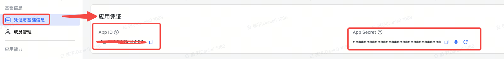

## JSON parser for Lark Card

This code is used to generate json data and scrape img from data shop, in order to create a streamline workflow of generating video recommendation card. Because it's a personal project, feel free to use the functions and fit it to your own need.

**Functionality**
- parse data into json format
- scrape product image from TTS
- use Lark API to extract img_key

**Environment Set Up:**
```
python3 -m pip install lark-oapi -U
python3 -m pip install pandas
```

**To get started**
1. To access the lark api, you need to get a lark bot first(https://open.larkoffice.com/app?lang=zh-CN)
> Read more about Lark bot: https://open.larkoffice.com/document/client-docs/bot-v3/bot-overview

2. Then access App ID & App secret


3. Set the APP ID and APP SECRET in get_img_key.py

4. Get data from data source with the format of video_table.csv, the data is ordered by gmv 
<!--  -->
5. run python program make_template_json.py

6. json output will be in **template.txt**

7. The lark card "优秀视频推荐卡片.card" is used for reference

---
>main file: make_template_json.py


